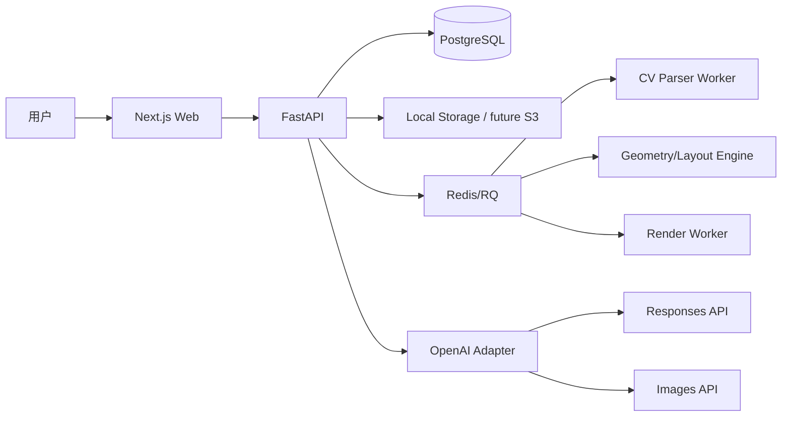

# NestCanvas Agent（栖画）C 端 AI 家居设计画布：重新设计实现方案

> 版本：v1.0  
> 日期：2026-06-20  
> 目标环境：WSL2 Ubuntu 22.04 + Python 3.10+ + Node.js 20+  
> 仓库建议名：`NestCanvas-Agent`  
> 产品原则：**OpenAI 负责“理解、抽取、解释、生成视觉概念”；本地代码负责“几何、尺寸、碰撞、可编辑结构”。**

---

## 1. 产品定义

### 1.1 名称与定位

**NestCanvas Agent（栖画）** 是一款面向买房、租房、装修用户的 AI 家居设计画布。

用户上传户型图、手绘草图或房间照片后，系统将其转化为可编辑 2D 空间结构；用户再通过自然语言描述生活方式、预算、风格偏好和功能诉求，系统生成多套可比较的家具布局与概念效果图。

### 1.2 一句话

> 把一张户型图，变成一个可看见、可调整、可分享的家。

### 1.3 产品边界

NestCanvas 不是施工图软件，也不判断结构拆改安全。它的核心价值是帮助普通用户快速完成：

1. 理解户型；
2. 表达需求；
3. 看到改造可能性；
4. 比较多套生活方式方案；
5. 把方案带给设计师、家人或销售沟通。

---

## 2. 目标用户与核心场景

| 用户 | 场景 | 痛点 | NestCanvas 输出 |
|---|---|---|---|
| 买房用户 | 看新房/二手房户型 | 不知道空间尺度、储物、采光、家具是否摆得下 | 户型理解 + 多套生活方式方案 |
| 装修用户 | 已有毛坯/旧房 | 不会表达风格，不知道如何布局 | 风格化布局 + 概念效果图 |
| 房产经纪/置业顾问 | 展示房源潜力 | 原始户型图转化弱 | 可分享视觉方案 |
| 软装/独立设计师 | 前期沟通 | 需求收集低效 | 结构化 brief + 初版方案 |

---

## 3. MVP 核心闭环

### 3.1 用户路径

```text
创建项目
  -> 上传户型图/房间图
  -> AI 解析为 FloorPlan JSON
  -> 用户校正比例尺、房间类型、门窗
  -> 输入自然语言需求
  -> AI 抽取 DesignBrief
  -> 本地布局引擎生成 2-3 套家具方案
  -> 生成概念效果图
  -> 保存/导出/分享
```

### 3.2 MVP 必做功能

| 模块 | 功能 | 技术实现 |
|---|---|---|
| 项目管理 | 创建项目、资产管理、历史方案 | FastAPI + PostgreSQL |
| 上传解析 | PNG/JPG/PDF 上传，生成初版 FloorPlan | OpenCV + OpenAI vision hints + fallback fixture |
| 2D 校正 | 房间、比例尺、门窗、墙体置信度展示 | SVG/Canvas + PATCH JSON |
| 需求抽取 | 自然语言转 DesignBrief | OpenAI Responses API + Structured Outputs |
| 布局生成 | 家具摆放、碰撞检测、通道校验 | Shapely + 规则引擎 |
| 概念渲染 | 生成室内效果图/风格切换图 | OpenAI Images API / image generation |
| 方案对比 | 2-3 套方案评分、风险提示 | 前端对比表 + SVG 叠加 |
| 导出 | PNG/SVG/JSON | 本地导出 |

### 3.3 MVP 不做

| 暂不做 | 原因 | 替代方案 |
|---|---|---|
| 施工图级输出 | 法规、结构、机电复杂 | 标注“概念方案” |
| 自动判定承重墙 | 图片无法可靠确认 | 用户手动标注“不可拆” |
| 商品级家具购买 | 供应链复杂 | 家具类型 + 尺寸占位 |
| 精确多视角一致 3D | 成本高 | 低保真 3D + 单张概念图 |
| 全自动无校正解析 | 输入质量不稳定 | 置信度 + 用户校正 |

---

## 4. 技术路线

### 4.1 总体判断

NestCanvas 应采用“双轨制”：

| 轨道 | 输出 | 技术 | 是否可作为事实依据 |
|---|---|---|---|
| 几何轨 | FloorPlan JSON、家具坐标、碰撞结果 | OpenCV、Shapely、规则引擎 | 是 |
| 视觉轨 | 概念效果图、风格图、氛围图 | OpenAI vision、Structured Outputs、image generation | 否，只作灵感展示 |

OpenAI 官方文档显示，Structured Outputs 可让模型输出符合 JSON Schema 的结构化内容；Images/Vision 支持图像输入理解，Image Generation 支持由文本或图像输入生成/编辑图像。因此，NestCanvas 应把 OpenAI 放在“语义层与视觉层”，而不是替代本地空间几何引擎。

### 4.2 技术栈

| 层 | 技术 | 说明 |
|---|---|---|
| Web | Next.js App Router + TypeScript + Tailwind + Zustand + zod | 轻量可控 |
| 2D 编辑 | SVG/Canvas；二期可换 Konva/Fabric | MVP 易实现 |
| API | FastAPI + Pydantic v2 | Schema 强校验 |
| 数据库 | PostgreSQL 16 | 项目与结构化 JSON |
| 队列 | Redis + RQ | 户型解析、渲染异步化 |
| CV | Pillow + OpenCV headless | 图像预处理、轮廓提取 |
| 几何 | Shapely | polygon、碰撞、面积、门口遮挡 |
| AI | OpenAI Python SDK | 视觉理解、brief 抽取、图像生成 |
| 测试 | pytest + httpx | API/算法测试 |

---

## 5. 系统架构



### 5.1 OpenAI 使用边界

所有 OpenAI 调用集中在：

```text
apps/api/app/services/openai_service.py
```

函数建议：

```python
def analyze_floorplan_image(image_path: str) -> FloorPlanHints: ...
def parse_design_brief(user_text: str) -> DesignBrief: ...
def build_render_prompt(floorplan: FloorPlan, option: LayoutOption, brief: DesignBrief) -> str: ...
def generate_interior_image(prompt: str, reference_image_path: str | None = None) -> RenderAsset: ...
```

环境变量：

```env
OPENAI_API_KEY=
OPENAI_MODEL_TEXT=gpt-5.5
OPENAI_MODEL_FAST=gpt-5.4-mini
OPENAI_IMAGE_MODEL=gpt-image-2
```

无 API Key 时必须走 deterministic mock，便于 Codex 在本地跑通测试。

---

## 6. 数据模型

### 6.1 坐标约定

- 单位统一为米；
- 原点为户型外包框左下角；
- x 向右，y 向上；
- 图像像素通过 `scale_m_per_px` 转换；
- 所有 polygon 必须闭合或在保存前由服务端闭合；
- 图像生成结果不能反向覆盖真实几何。

### 6.2 核心实体

| 实体 | 字段 |
|---|---|
| Project | id, title, status, created_at |
| Asset | id, project_id, asset_type, local_path, mime_type, width, height, metadata |
| FloorPlan | version, unit, scale_m_per_px, boundary, rooms, walls, doors, windows, warnings, confidence |
| Room | id, room_type, polygon, area_m2, confidence |
| Wall | id, centerline, thickness_m, confidence, load_bearing_status |
| DoorWindow | id, type, wall_id, bbox, width_m, swing_direction |
| DesignBrief | style, budget_cny, residents, room_priorities, must_have, avoid, storage_level, color_palette, constraints |
| FurnitureItem | id, category, room_id, bbox, rotation_deg, dimensions_m, clearance_m, material_hint |
| LayoutOption | id, strategy, furniture_items, score, hard_errors, soft_warnings, metrics |
| RenderAsset | id, option_id, prompt, output_path, disclaimer |

### 6.3 FloorPlan JSON 示例

```json
{
  "version": "1.0",
  "unit": "m",
  "scale_m_per_px": 0.025,
  "boundary": [[0, 0], [9.8, 0], [9.8, 7.2], [0, 7.2]],
  "rooms": [
    {
      "id": "room_living_1",
      "room_type": "living_room",
      "polygon": [[0.2, 0.2], [4.8, 0.2], [4.8, 3.9], [0.2, 3.9]],
      "area_m2": 17.0,
      "confidence": 0.86
    }
  ],
  "walls": [],
  "doors": [],
  "windows": [],
  "warnings": ["MVP fallback floorplan; please calibrate scale."],
  "confidence": 0.62
}
```

### 6.4 DesignBrief JSON 示例

```json
{
  "style": "warm_wood_minimal",
  "budget_cny": 200000,
  "residents": ["couple", "child"],
  "room_priorities": ["living_room", "master_bedroom"],
  "must_have": ["large_bookshelf", "walk_in_closet", "more_storage"],
  "avoid": ["dark_palette", "heavy_luxury"],
  "storage_level": "high",
  "color_palette": ["warm white", "oak", "linen"],
  "constraints": ["keep existing walls", "do not block balcony door"]
}
```

---

## 7. 核心算法设计

### 7.1 户型解析流水线

```text
upload asset
  -> image normalization
  -> grayscale / denoise / threshold
  -> line and contour detection
  -> candidate wall segments
  -> polygon reconstruction
  -> room region estimation
  -> OpenAI vision hints for OCR/room labels/reference notes
  -> FloorPlan JSON
  -> confidence + warnings
```

MVP 阶段允许 fallback fixture，但必须保留替换接口：

```python
class FloorPlanParser:
    def parse(self, image_path: str) -> FloorPlan:
        ...
```

后续可替换为 CubiCasa5K 训练的 segmentation/vectorization 模型。CubiCasa5K 是 5,000 个户型图、80+ 类标注的数据集；Matterport3D 则适合后续室内 RGB-D 空间理解研究。

### 7.2 布局生成

布局引擎不得依赖 LLM 生成家具坐标。

流程：

```text
FloorPlan + DesignBrief
  -> identify functional rooms
  -> select furniture templates
  -> generate candidate placements by room type
  -> Shapely collision check
  -> door/window blocking check
  -> clearance/path check
  -> score and rank
  -> return 2-3 layout options
```

必须实现函数：

```python
def normalize_polygon(points): ...
def polygon_area_m2(points): ...
def bbox_polygon(x, y, w, h, rotation_deg): ...
def detect_collisions(furniture_items, walls, rooms): ...
def detect_door_blocking(furniture_items, doors): ...
def min_clearance_check(furniture_items, room_polygon, threshold_m): ...
def score_layout(option): ...
```

### 7.3 三套默认策略

| 策略 | 目标 | 典型变化 |
|---|---|---|
| `balanced_storage` | 储物和居住均衡 | 增加柜体、保留通道 |
| `open_living` | 客餐厅更开阔 | 少放柜体、扩大活动区 |
| `family_friendly` | 有孩家庭 | 安全通道、儿童收纳、减少尖角 |

---

## 8. API 设计

| Method | Path | 说明 |
|---|---|---|
| POST | `/api/projects` | 创建项目 |
| GET | `/api/projects/{project_id}` | 项目聚合视图 |
| POST | `/api/projects/{project_id}/assets` | 上传图片/PDF |
| POST | `/api/projects/{project_id}/parse-floorplan` | 创建解析任务 |
| GET | `/api/jobs/{job_id}` | 查询任务状态 |
| GET | `/api/floorplans/{floorplan_id}` | 获取 FloorPlan |
| PATCH | `/api/floorplans/{floorplan_id}` | 保存校正结果 |
| POST | `/api/projects/{project_id}/brief` | 需求抽取 |
| POST | `/api/projects/{project_id}/layout-options` | 生成家具布局 |
| POST | `/api/layout-options/{option_id}/render` | 生成概念图 |
| GET | `/api/projects/{project_id}/renders` | 获取渲染结果 |

---

## 9. 前端信息架构

```text
/
/projects/[id]/upload
/projects/[id]/floorplan
/projects/[id]/brief
/projects/[id]/options
/projects/[id]/renders
```

### 9.1 页面说明

| 页面 | 主要组件 |
|---|---|
| 首页 | 品牌说明、创建项目 |
| 上传页 | 文件上传、预览、解析按钮、任务进度 |
| 户型页 | SVG 户型、房间类型编辑、比例尺输入、warnings |
| 需求页 | 聊天式输入框、结构化 brief 卡片 |
| 方案页 | SVG 家具叠加、评分、碰撞/门口风险 |
| 渲染页 | 概念图、prompt、免责声明 |

---

## 10. 质量与测试

### 10.1 pytest 必测

| 测试 | 目标 |
|---|---|
| FloorPlan schema valid | fixture 可通过 Pydantic |
| DesignBrief mock parse | 无 key 时稳定输出 |
| collision detection | 重叠家具能被发现 |
| door blocking | 家具挡门能被发现 |
| layout generation | 至少返回 2 套方案 |
| API happy path | 项目 -> 上传 -> brief -> layout 闭环 |

### 10.2 产品指标

| 指标 | MVP 目标 |
|---|---|
| 用户从上传到看到布局 | < 60 秒 |
| 布局硬错误 | 0 个或明确提示 |
| 概念图免责声明覆盖率 | 100% |
| 用户手动校正步骤 | 不超过 3 个关键动作 |
| 方案保存率 | 验证阶段目标 > 20% |

---

## 11. 8 周开发计划

| 周 | 目标 | 交付 |
|---|---|---|
| 1 | Monorepo + infra | FastAPI/Next.js/Postgres/Redis |
| 2 | 项目与上传 | project/assets/storage |
| 3 | FloorPlan parser MVP | OpenCV + fallback JSON |
| 4 | 2D 校正 UI | SVG + PATCH |
| 5 | Brief 抽取 | OpenAI Structured Outputs + mock |
| 6 | 布局引擎 | Shapely 碰撞/门口/通道 |
| 7 | 概念渲染 | Images API + mock render |
| 8 | 测试与 README | pytest、演示数据、错误处理 |

---

## 12. 风险与规避

| 风险 | 规避 |
|---|---|
| 用户误以为可施工 | 所有导出和渲染加“概念方案”说明 |
| 户型识别错误 | 置信度 + 快速校正 + fallback |
| 生成图改变户型结构 | 效果图只作灵感，真实几何以 FloorPlan JSON 为准 |
| OpenAI 成本不可控 | job 级预算、缓存、mock、本地 preview |
| 数据隐私 | 本地存储、日志脱敏、删除接口二期实现 |

---

## 13. Codex Prompt（可复制）

```text
你是资深 AI 全栈工程师 + 空间计算工程师。请在当前空仓库中实现 `NestCanvas-Agent`（栖画智能体）MVP，目标运行环境为 WSL2 Ubuntu 22.04。请直接创建可运行代码、测试、fixtures、README，不要只写说明。

# 0. 产品目标
NestCanvas Agent（栖画）是面向买房/装修用户的 C 端 AI 家居设计画布。用户上传户型图、手绘草图或房间照片后，系统生成可校正的 2D FloorPlan JSON；用户通过自然语言表达需求，系统抽取结构化 DesignBrief；本地布局引擎生成 2-3 套可校验家具方案；OpenAI 只负责视觉理解、结构化抽取、渲染提示词生成和概念图生成，不直接决定最终几何。

# 1. 强制技术栈
- Monorepo：`NestCanvas-Agent/`
- 后端：FastAPI + Pydantic v2 + SQLAlchemy 2 + Alembic + PostgreSQL 16 + Redis/RQ + OpenAI Python SDK + Pillow + OpenCV headless + Shapely + python-multipart + pytest。
- 前端：Next.js App Router + TypeScript + Tailwind + Zustand + zod + SVG/Canvas。不要引入复杂 UI 框架；保持可读可改。
- 基础设施：`infra/docker-compose.yml` 启动 postgres:16 和 redis:7。
- Python 3.10+，Node.js 20+。

# 2. 仓库结构
请创建：
NestCanvas-Agent/
  apps/api/
    app/main.py
    app/core/config.py
    app/db/
    app/models/
    app/schemas/
    app/routes/
    app/services/openai_service.py
    app/services/geometry_service.py
    app/services/layout_service.py
    app/services/render_prompt_service.py
    app/workers/jobs.py
    tests/
  apps/web/
    app/
    components/
    lib/api.ts
    lib/types.ts
    store/
  packages/schemas/
    floorplan.schema.json
    design_brief.schema.json
  tests/fixtures/
    simple_2br_floorplan.json
    sample_design_brief.json
    sample_layout_option.json
  infra/docker-compose.yml
  .env.example
  README.md

# 3. 核心数据模型
实现以下 Pydantic schema，并在 API 中复用：
- Project：id, title, created_at, status。
- Asset：id, project_id, asset_type=image|pdf|render|export, local_path, mime_type, width, height, metadata。
- FloorPlan：version, unit=m, scale_m_per_px, boundary, rooms, walls, doors, windows, warnings, confidence。
- Room：id, room_type, polygon, area_m2, confidence。
- Wall：id, centerline, thickness_m, confidence, load_bearing_status=unknown|user_marked_load_bearing|user_marked_non_load_bearing。
- DoorWindow：id, type=door|window, wall_id, bbox, width_m, swing_direction。
- DesignBrief：style, budget_cny, residents, room_priorities, must_have, avoid, storage_level, color_palette, constraints。
- FurnitureItem：id, category, room_id, bbox, rotation_deg, dimensions_m, clearance_m, material_hint。
- LayoutOption：id, strategy, furniture_items, score, hard_errors, soft_warnings, metrics。
- RenderJob/RenderAsset：status, prompt, input_option_id, output_path, disclaimer。

# 4. 后端 API
必须实现并能通过 pytest happy path：
1. `POST /api/projects`：创建项目。
2. `POST /api/projects/{project_id}/assets`：上传图片/PDF，保存到 `storage/`，写 DB。
3. `POST /api/projects/{project_id}/parse-floorplan`：创建 RQ job；MVP 用 OpenCV 边缘/轮廓检测 + fallback fixture 生成 FloorPlan。必须返回 job_id。
4. `GET /api/jobs/{job_id}`：返回 status、stage、progress、result_id、error。
5. `GET /api/projects/{project_id}`：返回项目聚合视图。
6. `GET /api/floorplans/{floorplan_id}`。
7. `PATCH /api/floorplans/{floorplan_id}`：保存用户校正后的 FloorPlan JSON。
8. `POST /api/projects/{project_id}/brief`：输入自然语言，调用 `openai_service.parse_design_brief()`，使用 Structured Outputs/Pydantic JSON Schema；无 OPENAI_API_KEY 时 deterministic mock。
9. `POST /api/projects/{project_id}/layout-options`：基于 FloorPlan + DesignBrief，用 Shapely 和规则引擎生成 2-3 套方案：balanced_storage、open_living、family_friendly。
10. `POST /api/layout-options/{option_id}/render`：生成概念图。无 OPENAI_API_KEY 时返回本地 mock SVG/PNG。真实调用封装在 `openai_service.generate_interior_image()`。
11. `GET /api/projects/{project_id}/renders`。

# 5. 几何与布局要求
不要让 LLM 直接输出家具坐标。必须实现：
- `normalize_polygon(points)`：修复方向、闭合、重复点。
- `polygon_area_m2(points)`。
- `bbox_polygon(x, y, w, h, rotation_deg)`。
- `detect_collisions(furniture_items, walls, rooms)`。
- `detect_door_blocking(furniture_items, doors)`。
- `min_clearance_check(furniture_items, room_polygon, threshold_m)`。
- `score_layout(option)`：硬错误直接严重扣分；软风险保留 warning。

家具规则至少包含：
- living_room：sofa, coffee_table, tv_console, bookshelf 可选。
- bedroom：bed, wardrobe, nightstand。
- dining_room/kitchen：dining_table 或 counter。
- bathroom：MVP 可只展示固定设施，不做生成。

# 6. OpenAI 使用边界
所有 OpenAI 调用只能在 `apps/api/app/services/openai_service.py` 中出现。模型名从环境变量读取：
- `OPENAI_MODEL_TEXT` 默认 `gpt-5.5`。
- `OPENAI_MODEL_FAST` 默认 `gpt-5.4-mini`。
- `OPENAI_IMAGE_MODEL` 默认 `gpt-image-2`。
实现以下函数：
- `analyze_floorplan_image(image_path) -> FloorPlanHints`：可先返回 mock，但接口保留。
- `parse_design_brief(user_text) -> DesignBrief`：严格 schema。
- `build_render_prompt(floorplan, layout_option, design_brief) -> str`。
- `generate_interior_image(prompt, reference_image_path=None) -> RenderAsset`。
如果没有 key，所有函数必须 deterministic mock，保证测试和本地演示可跑。

# 7. 前端页面
使用 Next.js App Router，实现：
1. `/`：产品首页 + 创建项目按钮，品牌名显示 `NestCanvas Agent（栖画）`。
2. `/projects/[id]/upload`：上传图片，预览，触发解析，轮询 job。
3. `/projects/[id]/floorplan`：2D SVG 展示 rooms/walls/doors/windows；允许编辑房间类型、比例尺、保存。
4. `/projects/[id]/brief`：聊天式输入需求，展示结构化 DesignBrief。
5. `/projects/[id]/options`：展示 2-3 套布局方案，SVG 叠加家具，显示 score、hard_errors、soft_warnings。
6. `/projects/[id]/renders`：显示概念图，固定提示：`概念效果图仅用于灵感展示，尺寸和可施工性以平面图校正结果为准。`

# 8. 测试
必须提供 pytest：
- FloorPlan schema valid。
- DesignBrief mock parse。
- furniture collision detection。
- door blocking detection。
- layout generation returns >=2 options。
- API happy path：创建项目 -> 上传 fixture -> parse job mock -> brief -> layout。
前端至少提供 TypeScript 类型检查脚本；README 写明如何运行。

# 9. README 与启动命令
README 必须包含：
- 产品定位。
- WSL2 Ubuntu 22.04 启动步骤。
- `.env.example` 说明。
- 后端命令：创建 venv、pip install、alembic upgrade、uvicorn。
- 前端命令：npm install、npm run dev。
- 测试命令：pytest。
- “已实现功能”。
- “限制与后续替换点”。
- “OpenAI API 使用位置”。

# 10. 代码质量
- 不要提交真实 API Key。
- 不要把 OpenAI 调用散落在 route 中。
- 错误响应要清晰。
- 所有坐标单位统一为米。
- 所有生成图都带 disclaimer。
- 先实现能跑通的最小闭环，再补测试并修复失败。
```

---

## 14. 参考资料

- OpenAI Structured Outputs: https://developers.openai.com/api/docs/guides/structured-outputs
- OpenAI Images and Vision: https://developers.openai.com/api/docs/guides/images-vision
- OpenAI Image Generation: https://developers.openai.com/api/docs/guides/image-generation
- OpenAI Models: https://developers.openai.com/api/docs/models
- OpenAI Codex CLI: https://developers.openai.com/codex/cli
- CubiCasa5K: https://github.com/cubicasa/cubicasa5k
- Matterport3D: https://niessner.github.io/Matterport/
- Shapely: https://shapely.readthedocs.io/
